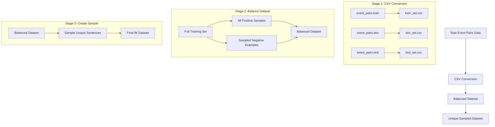

# Data Processing Scripts

This directory contains scripts for processing the event coreference dataset.

## Scripts Overview

### `sample_train_data.py`

A comprehensive data processing script that handles the complete pipeline from raw event pairs data to the final sampled dataset.

#### Pipeline Stages



#### Usage

```bash
python sample_train_data.py
```

#### Output Files

- `train_set.csv`: Converted training data
- `dev_set.csv`: Converted development data
- `test_set.csv`: Converted test data
- `balanced_train_set.csv`: Balanced dataset
- `unique_sample_9k_reason.csv`: Final sampled dataset

#### Data Format

Each row in the CSV files contains:
- Sentence pairs with event mentions
- Trigger word indices and extracted triggers
- Participant, time, and location spans (if available)
- Binary coreference label (1: coreferent, 0: non-coreferent)
- Total sentence length
- Event IDs (test set only) 

### `reasoning_collector.py`

A script for collecting reasoning data from the DeepSeek API for event coreference analysis. Used `asyncio` for efficient batch processing.

```bash
python reasoning_collector.py
```

Required variables:
- `api_key`: Your DeepSeek API key, you need to modify the script to run

#### Output Files

- `results_intermediate.csv`: Saves progress during processing
- `results_final.csv`: Complete dataset with model responses

### `eval_reasoning_data.py`

A comprehensive evaluation script for analyzing model performance on event coreference predictions.

```bash
python eval_reasoning_data.py
```

#### Output Files

- `reason_deepseek_r1_train.csv`: Processed results with reasoning content

#### Metrics Output Format

```
Per-class metrics:

Class 0:
Precision: 0.840
Recall: 0.968
F1: 0.900

Class 1:
Precision: 0.953
Recall: 0.779
F1: 0.857

Macro average:
Precision: 0.897
Recall: 0.873
F1: 0.879

Overall Accuracy: 0.882
```

### `train_modernbert.py`

Train ModernBERT model for event coreference classification.

```bash
python scripts/train_modernbert.py \
  --model_name answerdotai/ModernBERT-base \
  --data_dir data \
  --output_dir models/bert \
  --epochs 3 \
  --train_batch_size 64 \
  --learning_rate 1e-5
```

### `train_qwen_instruct_sft.py`

Fine-tune Qwen model with instruction tuning.

```bash
python scripts/train_qwen_instruct_sft.py \
  --model_name Qwen/Qwen2.5-0.5B-Instruct \
  --data_dir data \
  --output_dir models/qwen \
  --num_epochs 1 \
  --batch_size 4
```

### `eval_modernbert.py`

Evaluate ModernBERT model performance.

```bash
python eval_modernbert.py --model_path models/final_model \
                         --data_dir data \
                         --output_dir evaluation_results
```

### `eval_qwen_instruct.py`

Evaluate Qwen model performance.

```bash
python eval_qwen_instruct.py --base_model Qwen/Qwen2.5-1.5B-Instruct \
                            --adapter_path models/qwen/final_model \
                            --data_dir data 