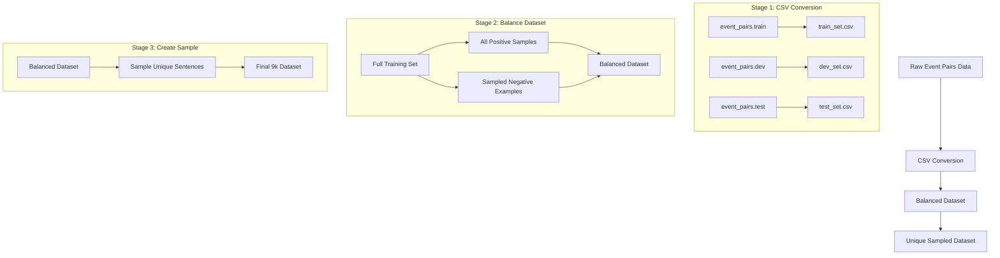

# Data Processing Scripts

This directory contains scripts for processing the event coreference dataset.

## Scripts Overview

### `sample_train_data.py`

A comprehensive data processing script that handles the complete pipeline from raw event pairs data to the final sampled dataset.

#### Pipeline Stages



#### Key Features

1. **Data Format Conversion**
   - Converts raw tab-separated data to CSV format
   - Handles train/dev/test sets separately
   - Extracts trigger words
   - Adds sentence length information

2. **Dataset Balancing**
   - Input: Full training set (~227k samples)
   - Keeps all positive samples (~19.6k)
   - Samples negative examples (20k)
   - Output: ~39.6k balanced samples

3. **Unique Sampling**
   - Creates diverse 9k sample dataset
   - Maintains sentence uniqueness
   - Preserves event coreference examples

#### Usage

```bash
python sample_train_data.py
```

#### Output Files

- `train_set.csv`: Converted training data
- `dev_set.csv`: Converted development data
- `test_set.csv`: Converted test data
- `balanced_train_set.csv`: Balanced dataset
- `unique_sample_9k_reason.csv`: Final sampled dataset

#### Data Format

Each row in the CSV files contains:
- Sentence pairs with event mentions
- Trigger word indices and extracted triggers
- Participant, time, and location spans (if available)
- Binary coreference label (1: coreferent, 0: non-coreferent)
- Total sentence length
- Event IDs (test set only) 